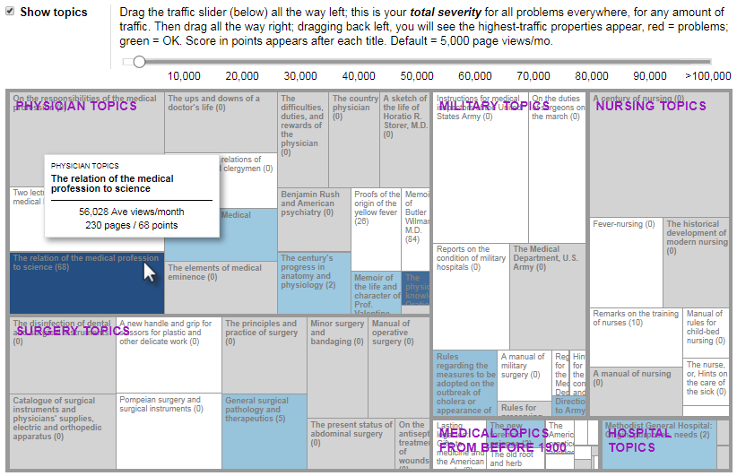

# Read Me

Source of this chart was Nathan Yau's [Jobs Charted by State and Salary.](http://flowingdata.com/2014/07/02/jobs-charted-by-state-and-salary/)

[Compact version of this (Github Gist).](http://bl.ocks.org/wendlingd/af1e751e97c5211ff11277c985e5e642)

## Visualize and Accelerate Web Site Repairs - D3.js treemap from JSON

> My car's dashboard has an indicator that tells me when it's time for an oil change and tune-up - it flashes **Maintenance Required**. My organization's web content management system has nothing similar; that's what this is for.

### Focus on the big picture and improve your web site quality

Have you felt blindsided by a new requirement to fix an issue that appears across your web site? How bad is this new problem? Or, are you struggling to meet an aggressive deadline for migration to a new video player? Wondering what area of your web site should be targeted next for conversion to responsive design? What is the scope of the work you need to do? In what sequence should this new work be done? How much staff time should be diverted to this task in the next x weeks? In web publishing, there are always components that are in transition, moving from "trusted" to "broken" and eventually to "obsolete." Do you know where they are? How much damage are they causing right now to your user experience? What do you plan to do about them?

When the job to be done is finding, scheduling, and fixing problems that are disrupting customer visits today, or finding and proactively retiring obsolete code and content that will hinder your organization's ability to deliver good experiences in the future, this tool can:

1. Help you visualize exactly where problems are occurring within your site, with their level of severity.
2. Reveal by microsite name and traffic how much this severity ought to matter to you as you organize your staff efforts to repair the site. While traffic should certainly play a role in how you manage your site, you should NOT use it in a way that damages your relationship with small target audiences. All site traffic should be judged relative to the size of their target audiences.

This is done by establishing a foundational metaphor for your whole ecology - a map. Then when any new situation arises, you overlay the new report, consisting of URL-Problem Description, quickly and easily onto the map, by itself or together with other problem reports, so all teams can comprehend the situation they are in and start on the shortest path to positive action.

Team members can conduct a lightweight cost-benefit analysis for every microsite they own, mentally comparing the **cost** of repairing the content, on the one hand, to an estimate of the resulting **benefit**, or lack thereof, of investing resources in repairs, on the other hand. Then they can work out fixing the content that's most important to the organizational mission, FIRST, and they can retire broken content that is no longer delivering benefits, which will free up staff time to improve the web communications that offer better return on your staff investment.

Web site repair does not need to be spotty or haphazard. Nor should an organization's content components be like leaves falling on a lake - highly visiable right after posting, but sinking out of site and out of mind shortly afterward, and yet, still there. Instead, you should proactively UNDERSTAND and PRIORITIZE work that should be done, based on an ecology-wide view encompassing your MISSION, the problem's severity, your staff availability, etc.

### Screenshot (this version is NOT interactive)

Rectangle volume shows relative number of HTML pages; some communication packages are small; some are large. Green shading / zero points means no errors were found. Shade of blue / total count of points show severity of the problem being analyzed. 

In this version of the map, points are used rather than the count of broken links, so management can increase the severity of a particular problem the organization wants solved before others. When one repair should be completed ASAP, staff will want to focus on only that one problem. When more time is available, staff can overlay multiple problem reports so they can make multiple types of repair when each page is opened for editing. In this display, broken link counts were multiplied by two in order to make broken links more prominent among multiple types of problems are being analyzed at the same time.

## Recommendations

- Create a database and add a 100-percent content inventory from a web spidering tool or a programmer's tool such as the HTML::Tree module of Perl.
- Aggregate content inventory components to two levels, (1) the top-level category as the people/resource considered to be the content steward or owner, shown here as "topics," and (2) by "communication package" name, also known as microsite or content group - one package for each thematic group of pages you own.
- For each communication package, create a summary strategy statement in the form, "By delivering (information) to (audience) we will be better able to (goal) because (justification)." Source: Bob Boiko, Metatorial Services Inc. (2008). "You want systems but you need strategy." In E. D. Koenig and T. K. Srikantaiah (Eds.), Knowledge Management in Practice: Connections and Context. ASIS&T Monograph Series. Medford, NJ: Information Today, Inc. See also Gothelf, Jeff, and Seident, Josh. (2016). Lean UX: Designing Great Products with Agile Teams, 2nd Ed. Sebastapol, CA: O'Reilly, Declaring assumptions.
- Export traffic in CSV from a traffic tool by month, join / aggregate to communication packages, divide total communication package traffic by the number of months for which data is available. This removes a bias against brand new content; for example, this method is better than comparing 12 months of data for most communication packages to 1 month of data for a communication package added last month. However, this method can provide artificially higher totals for low-traffic packages.
- After you have the inventory and average monthly traffic as the foundation, you can layer on one or more issues of the day - shown here is a common problem, broken link reporting, an easy join in the database.
- Currently, clicking a rectangle takes the user to a blank database report page. Use this to provide the list of individual pages to repair.
- Under the chart, add a sortable table as an accessible equivalent.
- In some cultures, red and green shading are the best and fastest way to communicate what is good and what is not. Some people have color blindness. If you know that your audience includes members who are color blind, you should change this shading. If you don't know whether your audience members have color blindness or not, you should change this shading. On the other hand, if the visualization is used for a small team known not to have color blindness, red and green may be the best way to communicate.
